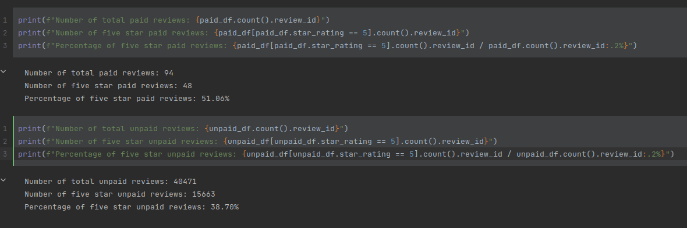

# Module 16

## Overview
The purpose of this analysis is to study video game reviews using an Amazon dataset. We only included reviews with the following criteria:
* 20 or more total votes
* Percentage of helpful votes >= 50%

## Results

**How many Vine reviews and non-Vine reviews were there?**
There are 94 Vine reviews and 40,471 non-Vine reviews.

**How many Vine reviews were 5 stars?**
48 Vine reviews were 5 stars.

**How many non-Vine reviews were 5 stars?**
15,663 non-Vine reviews were 5 stars.

**What percentage of Vine reviews were 5 stars?** 
51.06% of Vine reviews were 5 stars.

**What percentage of non-Vine reviews were 5 stars?**
38.70% of non-Vine reviews were 5 stars

## Summary
There may be evidence of positivity bias for reviews in the Vine program. This can be judged by the fact that the percentage of five star paid reviews is about 12% higher than the percentage of five star non-paid reviews. To be more certain of this assessment, a t-test should be performed to assess the statistical significance.
